# Products and Quotations UI/UX Audit

Date: 2026-08-29

## Scope

- Products catalog, filtering, no-results state, and product detail modal.
- Quotations index, quotation detail modal, quote creation, line-item creation, and mobile reflow.
- Desktop viewport: 1440 x 1000.
- Mobile viewport: 390 x 844.
- Visual data was intercepted with realistic local fixtures because the audit does not depend on production records.

## Overall Verdict

The shared shell and page headers now feel professional, restrained, and consistent. Products is usable for a small catalog and Quotations is understandable at a glance. Both pages still model operational records as large cards, however, which becomes inefficient as record counts grow. The most serious defect is the quotation detail modal on mobile: desktop-width content remains wider than the viewport and is visibly clipped.

Recommended direction:

- Keep cards for mobile and optional visual browsing.
- Use a compact, sortable list/table as the default desktop representation.
- Treat record details as structured workspaces or drawers, not collections of decorative cards.
- Establish one primary action per context and move secondary/destructive actions into an overflow menu.
- Make quotation statuses a controlled lifecycle rather than a freely editable decorative label.

## Evidence

### 1. Products list - desktop

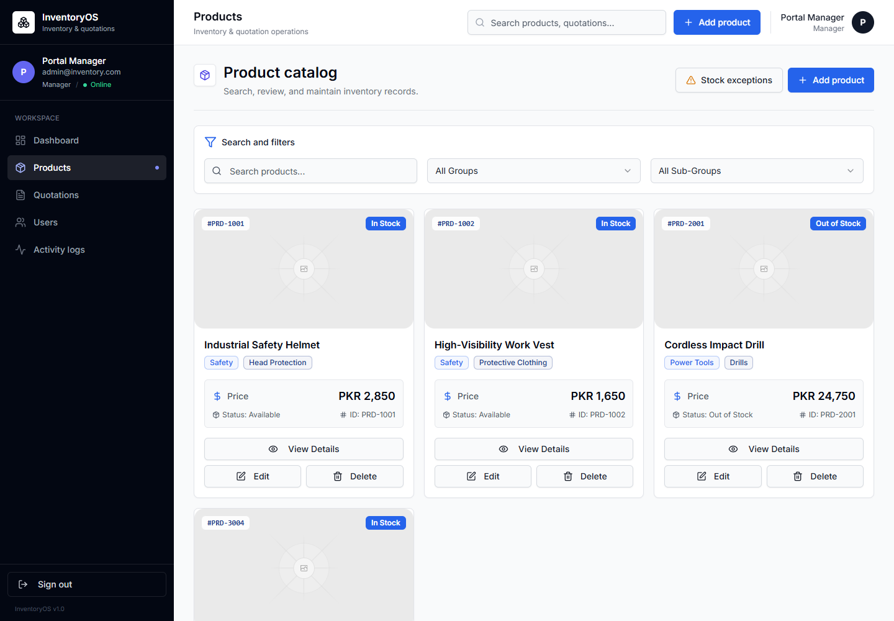

Health: Good for a small catalog; weak scalability.

Strengths:

- Clear page title, inventory-specific description, and obvious stock-exception entry point.
- Search, group, and subgroup controls are grouped coherently.
- Product names, identifiers, classification, price, and availability are easy to locate.
- The three-column rhythm is visually stable at this viewport.

Issues:

- `Add product` appears in both the global header and page heading. The duplicate primary action adds noise without adding capability.
- Product images occupy roughly one third of each card. When no real image exists, the empty placeholder becomes the strongest visual element and pushes useful data below it.
- Product ID and stock status are repeated in multiple parts of each card.
- `View Details`, `Edit`, and `Delete` are permanently visible for every record. This makes destructive actions look routine and creates a large amount of repeated chrome.
- In-stock and out-of-stock badges use the same dominant blue treatment. Their semantic difference is therefore weaker than their wording.
- There is no result count, sort control, stock-status filter, pagination, density switch, saved view, or bulk-selection affordance.
- Cards make side-by-side SKU, price, stock, and category comparison slower than a table would.

Recommendation:

- Default desktop to a compact table with image, product/SKU, group, selling price, stock status, updated date, and an overflow menu.
- Retain a card/grid toggle for image-led browsing and mobile.
- Show `View` on row click or product-name click; keep `Edit` in a contextual menu and `Delete` behind a destructive menu item plus confirmation.
- Add result count, sort, stock filter, saved views, pagination, and bulk selection when supported by the underlying behavior.
- Collapse missing media to a small thumbnail rather than rendering a large blank image stage.

### 2. Product detail modal - desktop and mobile

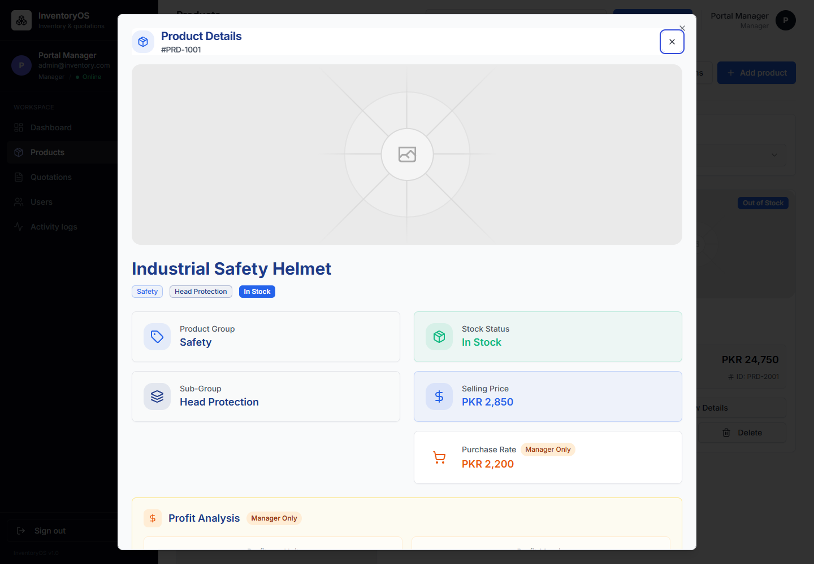

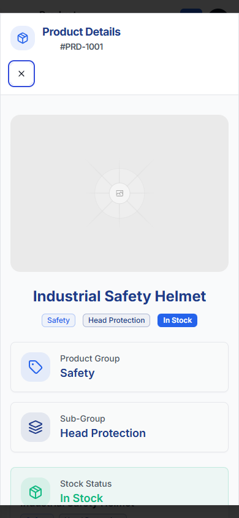

Health: Desktop is readable; mobile hierarchy and dialog behavior need revision.

Strengths:

- The product name and SKU are prominent.
- Role-sensitive purchase and profit information is clearly marked.
- Group, subgroup, availability, selling price, purchase rate, and margin are present.

Issues:

- The desktop dialog shows two close controls: Radix's default close button and a custom close button.
- On mobile, the custom close control occupies its own row at the left edge, detached from the title and inconsistent with common dialog behavior.
- The dialog is a long vertical stack of bordered panels. This creates card-inside-modal density and makes every fact appear equally important.
- Large blue headings, blue values, blue status badges, and blue icon containers create a one-note visual hierarchy.
- The large media area remains dominant even when the product has no image.
- The dialog component emits a missing description warning, indicating incomplete accessible dialog labeling.
- At mobile width this much structured information would be better served by a full-screen detail view or bottom sheet with a sticky header.

Recommendation:

- Use exactly one close button in the top-right corner.
- Add `DialogDescription` or a valid `aria-describedby` relationship.
- Replace nested metric cards with two definition-list sections: product facts and commercial data.
- Use semantic green/amber/red only for stock and margin status; keep ordinary values neutral.
- On mobile, use a full-screen sheet with a sticky title bar and compact media thumbnail.

### 3. Product no-results state

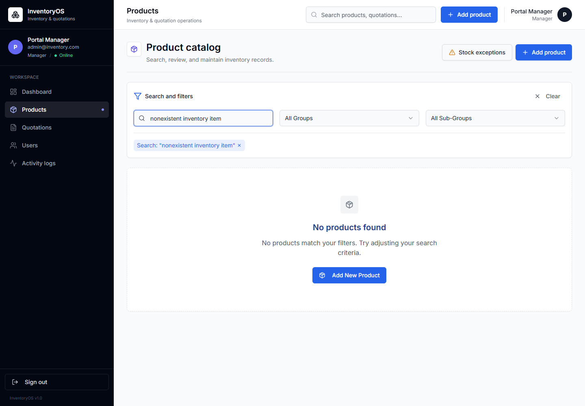

Health: Clear message; incorrect recovery action.

Strengths:

- Active search criteria are visible and removable.
- The empty-state explanation correctly says that filters produced no match.

Issue:

- The primary recovery action is `Add New Product`. For a no-results state caused by a search, the likely task is to clear or adjust filters, not create a product. This can encourage accidental duplication.

Recommendation:

- Make `Clear filters` the primary action.
- Show `Add product` as a secondary action only when the search resembles a deliberate new SKU/name and the user has permission.

### 4. Products - mobile list

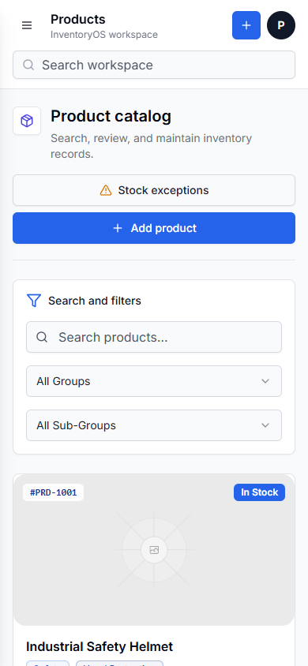

Health: Responsive and readable; too vertically expensive.

Strengths:

- Header controls, page actions, and filters stack without overlap.
- Touch targets are comfortably sized.
- The first record enters the viewport with a clear status badge.

Issues:

- The global workspace search and local product search appear close together and can be confused.
- The page action area, filter panel, and large product media consume most of the first two screens.
- A large missing-image stage makes record browsing slow on a phone.

Recommendation:

- Remove or collapse global search on pages that already provide a dedicated search.
- Use compact list rows on mobile: 64px thumbnail, product/SKU, price, stock, and chevron.
- Move advanced filters into a sheet and show active-filter chips above results.

### 5. Quotations list - desktop

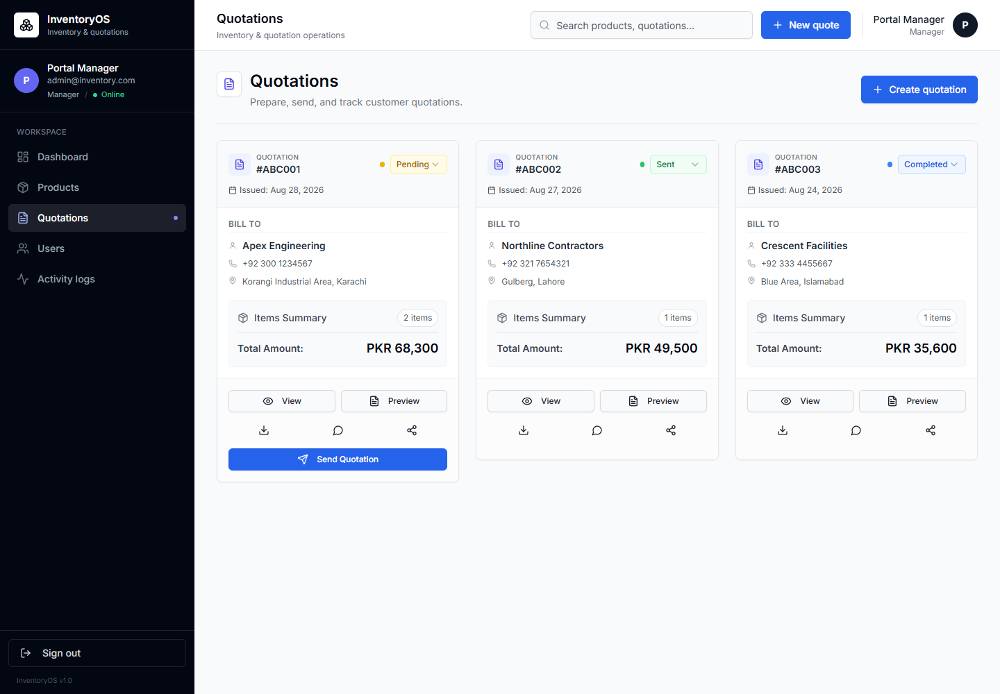

Health: Visually polished for a small set; operationally underpowered.

Strengths:

- Quote number, customer, issue date, value, item count, and status are easy to scan within one card.
- Pending, sent, and completed states have distinct semantic colors.
- The pending quote gives the send action appropriate prominence.

Issues:

- `New quote` and `Create quotation` duplicate the same primary action.
- There is no quote-specific search, status view, expiry view, sort, result count, pagination, customer filter, owner filter, or date range.
- A three-column card grid makes amount, date, status, and customer comparison slower as volume increases.
- Status is directly editable inside every card. This makes consequential state changes look like ordinary filtering and can permit accidental or invalid transitions.
- `View` and `Preview` are not clearly differentiated.
- Download, WhatsApp, and share are icon-only controls without visible labels or tooltips.
- The action footer can contain six actions on one card, giving every action similar weight.
- `1 items` is grammatically incorrect.

Recommendation:

- Use status tabs or saved views such as All, Draft/Pending, Sent, Expiring, Completed, and Cancelled.
- Default desktop to a table with quote number, customer, total, status, issued date, expiry, owner, and last activity.
- Use one row action (`Open`) and an overflow menu for preview, download, copy link, WhatsApp, cancel, and other secondary actions.
- Rename `View` to `Open details` and `Preview` to `Customer preview`.
- Move status changes into an explicit action menu and only show valid next transitions.

### 6. Quotation detail modal - desktop

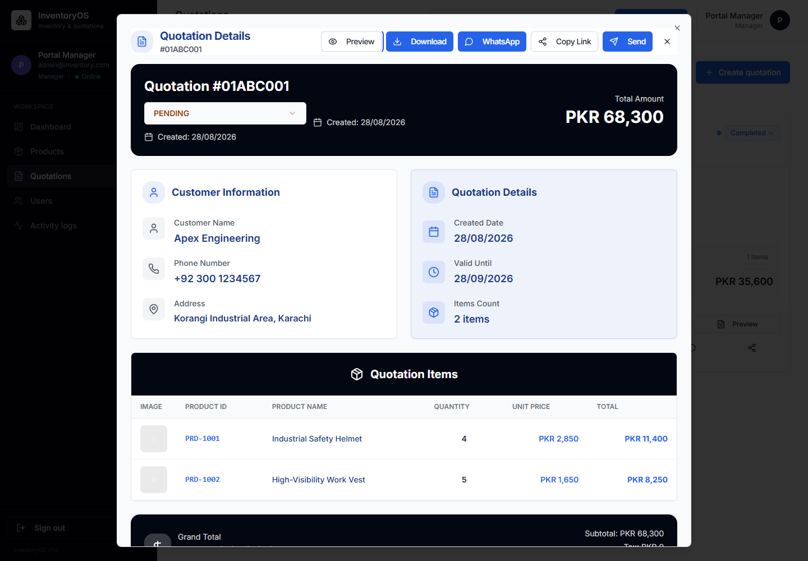

Health: Information-rich but over-styled and action-heavy.

Strengths:

- Customer, value, line items, and status are immediately available.
- The item table is easier to compare than the card-based list.
- Total amount is prominent.

Issues:

- Preview, Download, WhatsApp, Copy Link, and Send all sit in the header as high-emphasis buttons.
- Two close controls appear in the top-right area.
- Created date appears more than once, while expiry is visually inferred as a separate fact.
- Dark full-width banners and multiple blue information cards make the modal feel like a dashboard inside a dialog.
- The code calculates `Valid Until` from the current date rather than showing a persisted quotation value, which can reduce trust when revisiting an older quote.
- The dialog emits a missing-description accessibility warning.

Recommendation:

- Keep one primary action based on state: `Send`, `Mark accepted`, or none for final states.
- Put PDF, WhatsApp, copy link, and cancel in an `Actions` menu; keep customer preview as the secondary button.
- Use one summary header followed by customer facts and the item table. Remove repeated section banners.
- Display an actual stored issue/expiry date or label a calculated value clearly.

### 7. Quotation detail modal - mobile

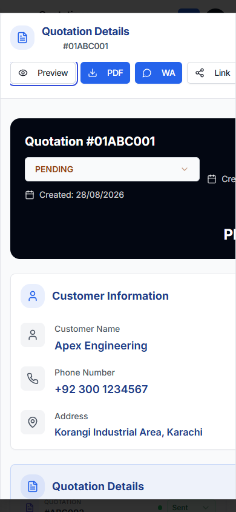

Health: Critical responsive defect.

Confirmed issues:

- The action row exceeds the viewport width and is clipped.
- The dark quotation summary retains desktop-width content; created-date and total content extend off-canvas.
- The modal body is wider than the visible viewport, creating horizontal loss of information.
- The close action is not visible in the accepted viewport.
- Large cards produce a very long scroll before the user reaches line items and totals.

Recommendation:

- Replace the modal with a full-screen mobile sheet.
- Use a sticky header with title, close, and one overflow menu.
- Stack quote number/status/amount vertically; never rely on horizontal scrolling for primary actions.
- Use compact definition rows for customer and quote metadata.
- Keep a sticky bottom action bar with one state-appropriate primary action.

### 8. Create quotation - empty state

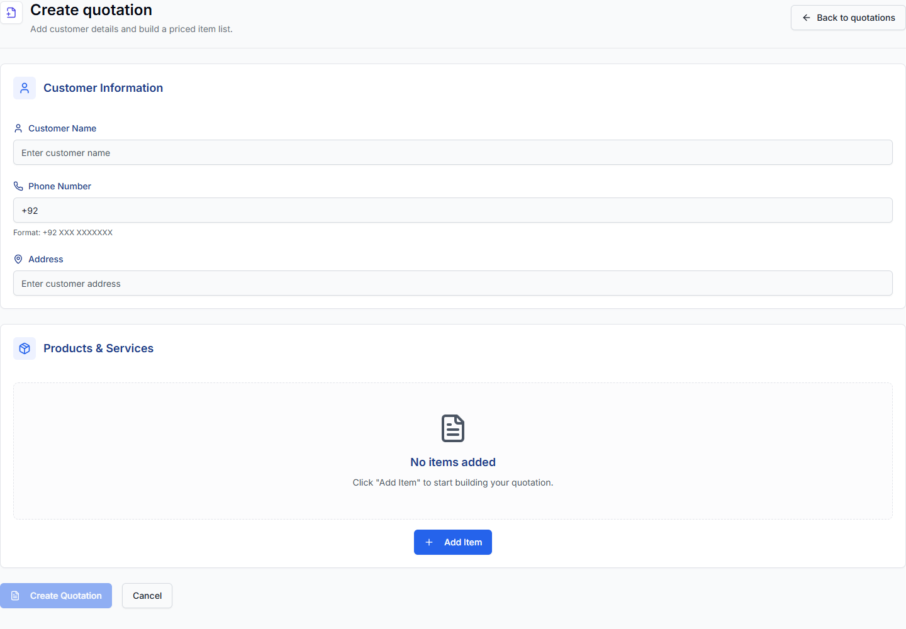

Health: Clear, but inefficient on desktop.

Strengths:

- Customer and line-item sections are clearly separated.
- Field labels and phone formatting guidance are visible.
- The empty line-item state explains the next action.

Issues:

- Three short customer fields each span the full desktop width, causing excessive eye travel and a large form footprint.
- Required fields are not visibly marked.
- The line-item empty state is very tall and pushes form actions below the fold.
- The disabled create button does not explain what is missing.

Recommendation:

- Use a two-column desktop grid: customer name and phone on the first row, address full width below.
- Mark required fields and provide inline error text.
- Reduce the empty line-item state to a compact row with `Add item` adjacent to the section heading.
- Keep a sticky footer with Cancel, total, and Create quotation; explain disabled state near the button.

### 9. Create quotation - line item

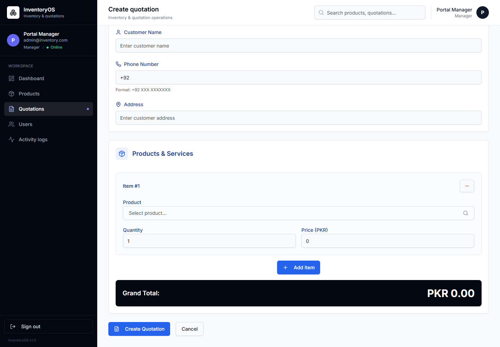

Health: Functional and legible; needs denser quote-builder behavior.

Strengths:

- Product selection, quantity, price, and total follow a sensible sequence.
- Quantity and price align horizontally on desktop.
- The grand total is easy to find.

Issues:

- A large bordered card is created for every item, making multi-item quotations excessively tall.
- The remove action is a minus symbol, which is less familiar and less explicit than a trash icon with a tooltip.
- Price looks like an ordinary input; users are not told whether it is the catalog price or an intentional override.
- The total panel is visually heavy before meaningful pricing exists (`PKR 0.00`).
- There is no visible line-number/summary table pattern for rapidly reviewing many products.

Recommendation:

- Use a compact line-item table on desktop and stacked line-item rows on mobile.
- Show product, quantity, unit price, line total, and row actions in one scanning line.
- Label overridden prices and visually distinguish them from inherited catalog prices.
- Use a trash icon with an accessible label and confirmation only when meaningful data would be lost.

### 10. Create quotation - mobile

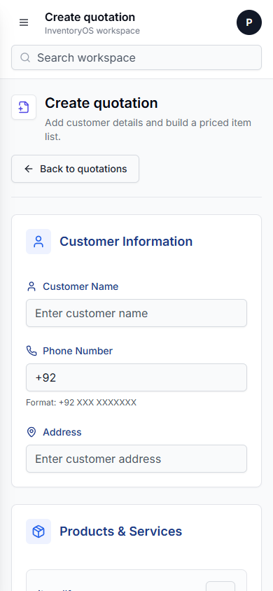

Health: Reflows correctly; workflow is long.

Strengths:

- No visible overlaps in the customer section.
- Labels, guidance, and controls remain readable.
- Back navigation is explicit.

Issues:

- The page requires extensive scrolling before line items, total, and submit controls are reached.
- The global search consumes vertical space but does not support the immediate quote-building task.
- A repeated card treatment makes sections feel heavier than necessary.

Recommendation:

- Hide global search on the create flow.
- Use a sticky bottom total/action bar.
- Collapse completed customer details into a compact summary while editing line items.
- Keep item search and `Add item` available near the bottom action area.

## Cross-Page System Recommendations

### Priority 0 - fix before release

1. Rebuild quotation-detail mobile reflow so no content or actions are clipped.
2. Remove duplicate close controls from both detail dialogs.
3. Add accessible dialog descriptions and verify focus trapping, Escape, return focus, and keyboard navigation.

### Priority 1 - high operational value

1. Replace desktop card grids with compact table/list views; keep cards as an optional mode.
2. Remove duplicate page/global create actions.
3. Introduce quote search, status views, sorting, result count, and pagination.
4. Clarify `Open details` versus `Customer preview`.
5. Reduce every quotation card/row to one primary action plus an overflow menu.
6. Make quote state transitions explicit and valid-state-aware.

### Priority 2 - quality and efficiency

1. Compact missing-image states and mobile product rows.
2. Replace nested metric cards in detail views with structured definition lists.
3. Improve product no-results recovery to prioritize clearing filters.
4. Densify customer and line-item form layouts on desktop.
5. Add sticky quote totals/actions on long desktop and mobile creation flows.
6. Add semantic singular/plural handling and tooltips for icon-only actions.

## Research Context

- Shopify's product admin supports search, sorting, editable columns, saved views, filtering, and bulk actions. This supports a list-first desktop model for a growing catalog: https://help.shopify.com/en/manual/products/searching-filtering
- Zoho Inventory exposes status/type filters, sortable stock and price fields, pagination, custom views, and identifier search. This supports stronger operational filtering and density: https://www.zoho.com/inventory/api/v1/items/
- Stripe models quotes as a controlled lifecycle (draft, open, accepted, canceled), with available actions determined by state. This supports guarded status transitions rather than a free dropdown: https://docs.stripe.com/quotes
- HubSpot's quote index uses status-oriented views and manages secondary actions from a preview/details context. This supports quote views plus a details workspace: https://knowledge.hubspot.com/quotes/manage-quotes
- PandaDoc's quote builder treats line items, quantities, prices, discounts, fees, and totals as one structured pricing surface. This supports a compact line-item editor rather than large independent cards: https://support.pandadoc.com/en/articles/14019817-pricing-tables-are-being-upgraded-to-quote-builder

## Evidence Limits

- Screenshots can confirm hierarchy, spacing, clipping, and responsive reflow, but not full WCAG compliance.
- Keyboard order, screen-reader announcements, zoom behavior, network latency, and destructive-action confirmation require separate interactive testing.
- API records were mocked locally. Production-scale pagination and loading behavior were not measured.
- Console output confirmed missing dialog-description warnings in both detail modals.
